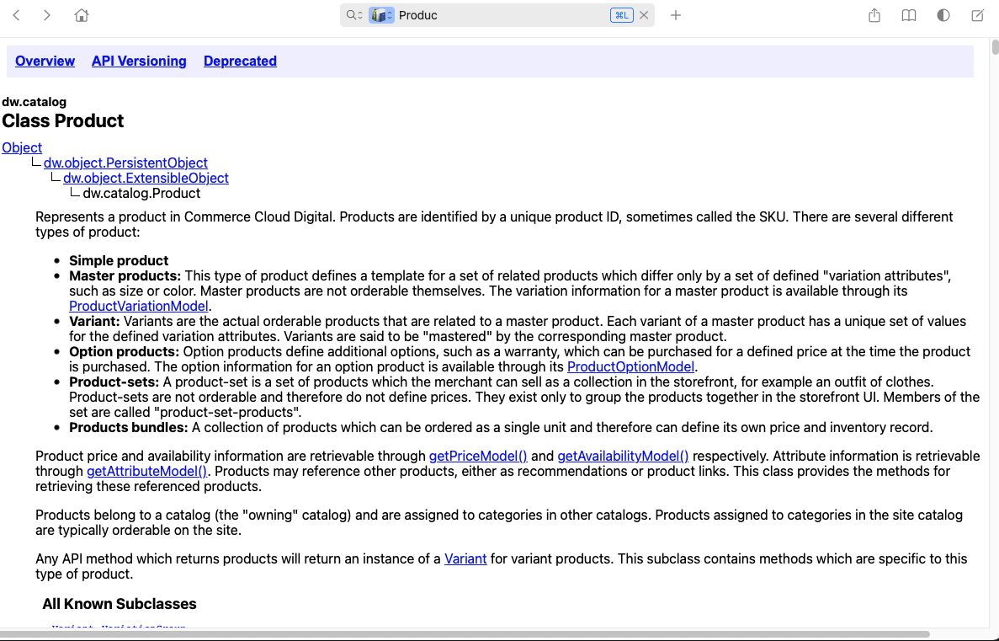
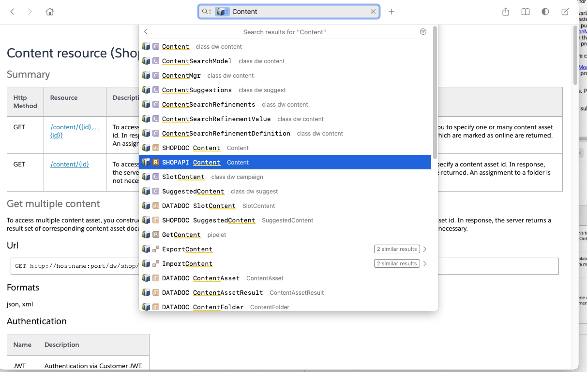

# Salesforce Commerce Cloud B2C Dash Doc Generator

See [releases](https://github.com/clavery/docset-sfcc-b2c/releases/latest) for the latest docset to install in dash.

# Installation

- Use the Feed URL: `https://raw.githubusercontent.com/clavery/docset-sfcc-b2c/main/SFCC_API.xml` or...
- Use the releases on the side to download a zip release
 
## Building

1. Download the API docs from your instance with WebDAV credentials
   1. https://dev04-na01-XXX.demandware.net:443/on/demandware.servlet/WFS/Studio/Sites/mock/demandware-mock.zip
   2. Extract...
   3. Extract contents of `DWAPP-##.#-API-doc.zip` zip to the `docs/` directory
2. Install requirements `uv sync`
3. Run `uv run ./api_to_dash_doc.py`
4. Install `SFCC_API.docset` to Dash
